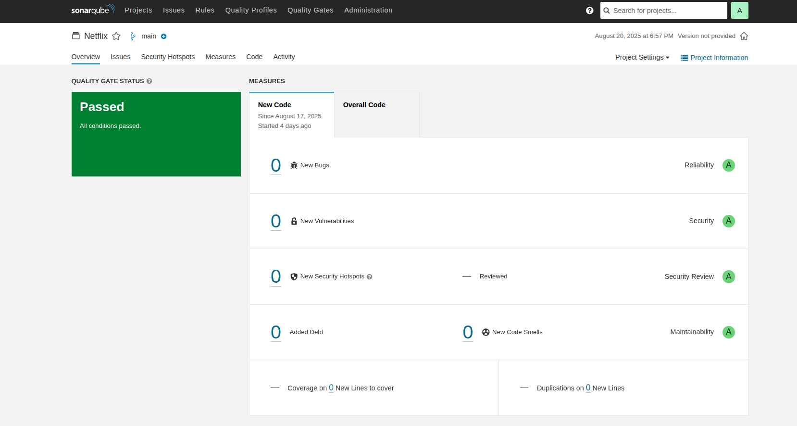

# 🎬 Netflix Clone - Complete DevSecOps Pipeline Implementation

A comprehensive DevSecOps project showcasing end-to-end CI/CD pipeline implementation with security integration, monitoring, and GitOps deployment practices on AWS cloud infrastructure.

## 🚀 Project Overview

This project demonstrates a production-ready DevSecOps pipeline for a Netflix clone application, focusing on automation, security, scalability, and observability. The implementation covers the entire software delivery lifecycle from code commit to production deployment.

### Key Features
- **Automated CI/CD Pipeline** with Jenkins
- **Security-First Approach** with vulnerability scanning at every stage
- **Container Orchestration** with Kubernetes (EKS)
- **GitOps Deployment** using ArgoCD
- **Real-time Monitoring** with Prometheus and Grafana
- **Infrastructure as Code** practices
- **Scalable Cloud Architecture** on AWS

## 🏗️ Architecture Diagram

<!-- Architecture diagram will be placed here -->

## Netflix Clone

## 🛠️ Tech Stack

### Cloud & Infrastructure
- **Cloud Platform**: AWS (EC2, EKS)
- **Operating System**: Ubuntu 22.04
- **Container Runtime**: Docker
- **Container Orchestration**: Kubernetes
- **Package Manager**: Helm

### CI/CD & DevOps Tools
- **CI/CD**: Jenkins
- **GitOps**: ArgoCD
- **Code Quality**: SonarQube
- **Security Scanning**: Trivy
- **Monitoring**: Prometheus
- **Visualization**: Grafana
- **Container Registry**: DockerHub

### Application
- **Frontend**: TypeScript
- **API Integration**: TMDB API
- **Web Server**: Nginx

## 📋 Prerequisites

Before you begin, ensure you have the following installed and configured:

- AWS CLI configured with appropriate permissions
- kubectl configured for EKS cluster
- Docker installed and running
- Jenkins with required plugins
- Git for version control
- TMDB API key for movie data

## 📊 Screenshots & Dashboards

### AWS Services

*EC2 Instance Configuration*

*EKS Cluster Overview*

### CI/CD Pipeline

*Jenkins Pipeline Dashboard*

*Complete CI/CD Pipeline*

### Code Quality & Security

*SonarQube Code Quality Analysis*

### Container Registry

*DockerHub Repository*

### Monitoring & Observability

*Prometheus Monitoring Targets*

*Grafana Monitoring Dashboard*

*Jenkins performance and health overview*

*Node exporter*

### GitOps Deployment

*ArgoCD GitOps Dashboard*

## 🔧 Jenkins Pipeline Configuration

The Jenkins pipeline includes the following stages:

1. **Clean Workspace** - Prepare clean environment
2. **Checkout from Git** - Pull latest code
3. **SonarQube Analysis** - Code quality scanning
4. **Quality Gate** - Ensure quality standards
5. **Install Dependencies** - NPM package installation
6. **Trivy FS Scan** - Filesystem vulnerability scan
7. **Docker Build & Push** - Container image creation
8. **Trivy Image Scan** - Container vulnerability scan
9. **Deploy to Container** - Application deployment
10. **ArgoCD Sync** - GitOps deployment to Kubernetes

## 📈 Monitoring & Metrics

### Prometheus Metrics
- Application performance metrics
- Infrastructure resource utilization
- Container health and status
- Jenkins pipeline metrics

### Grafana Dashboards
- System Overview Dashboard
- Application Metrics Dashboard
- Jenkins Pipeline Dashboard
- Kubernetes Cluster Dashboard

## 🔒 Security Features

- **Static Code Analysis** with SonarQube
- **Container Vulnerability Scanning** with Trivy
- **Secure Secret Management** in Kubernetes
- **Network Security Policies**
- **Role-Based Access Control (RBAC)**

## 🎯 Key Learning Outcomes

- ✅ End-to-end DevSecOps pipeline implementation
- ✅ AWS cloud services and EKS management
- ✅ Security scanning integration in CI/CD workflows
- ✅ GitOps principles and ArgoCD deployment strategies
- ✅ Monitoring and observability with Prometheus/Grafana
- ✅ Container orchestration with Kubernetes
- ✅ Infrastructure automation and scaling

## 📝 Acknowledgments

Special thanks to [Nasiullha Chaudhari](https://github.com/N4si) for the original [DevSecOps Project](https://github.com/N4si/DevSecOps-Project) that served as a reference for this implementation. This project allowed me to gain practical hands-on experience with real-world DevSecOps practices.

## 📞 Contact

Feel free to connect with me for discussions about DevOps, cloud computing, or any questions about this project:

- **GitHub**: [deep2234](https://github.com/deep2234)
- **LinkedIn**: [www.linkedin.com/in/dipshill/]

